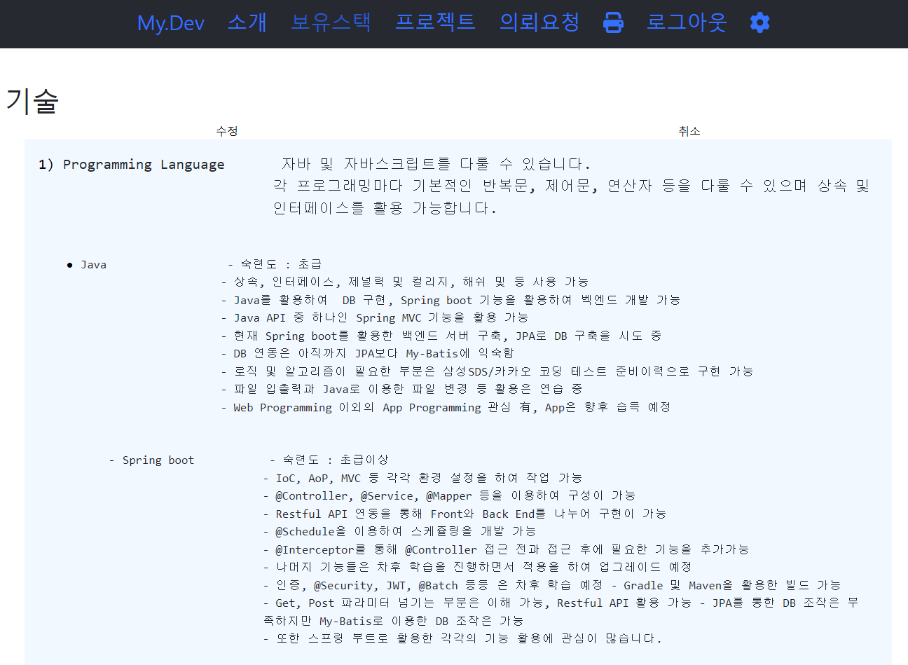

# Profile
- 개발자용 프로필 소개 구성
- Spring boot + ReactJS 기반 프로젝트로 구성
- JPA와 MySQL 혹은 MariaDB를 사용하여 데이터베이스 사용

# 프로젝트 소개
- 프로젝트 시작하게 된 계기는 잊어버렸던 코딩 실력을 재활을 목적으로 하여 실시 
- 프로젝트를 만든 목적은 코딩 실력을 향상 시키고자 하여 React와 Spring boot로 시작
- 독학을 하면서 혼자서 만든 프로젝트
- 저를 외부로 알리면서 프로젝트 협업 파트너를 구하고, 프로젝트 의뢰를 받아 프로젝트를 수행역할을 하고, 마지막으로 IT 업체들에게 홍보를 목적으로 제작 한 것이 목적
- 완성 후 차후 크몽, 숨고 사이트, 티스토리 블로그와 연동하는 형태로 의뢰사항 및 게시물 히스토리를 사용자에게 노출시킬 예정
- URL : <link>http://www.berkleylim.link/</link> 

# 개발 기간
- 1차 : 22.05.01 ~ 22.10.15 (현재 진행형으로 개발, 유지보수 중)
- 2차(운영이후) : 2022.11 ~ (~ing)
- 
# 개발 환경
- OpenJDK 17
- Gradle 7.5.4
- IDE : VS code
- FrameWork : Spring Boot (2.xx)
- Database : MySQL
- ORM : JPA

# 주요 기능
- 메인, 소개, 보유스택, 프로젝트, 의뢰요청, 관리자페이지(로그인후 보임) - 메인 공지, 의뢰 결과 확인


# 사용 방법 (VS Code 환경 기준)
Git 사이트에서 먼저 Git을 설치 후 작업 가능 합니다.
현재 운영 중이나, 추가 개발을 위해 지금 현재 사용하지 않는 환경 설정은 남기고 있으나,
차후, 앞으로 필요 없을 환경 설정은 제거 할 예정입니다.

# 작업 과제
- React : 반응형 웹&앱 도입 예정 100px, 200px, 400px, 600px, 1200px 별 UI 설정 (Todolist 토이 프로젝트로 먼저 연습 후 개발예정) - 현재 1200px 플랙스로 고정하여 적용됨 (모바일로 확인 시 편의성 개편)
- css 문법 : sass형 or style-component 형태로 커스텀 마이징 css 제작으로 리팩토링
- Spring Boot Security + JWT : 단순 아이디 비밀번호 검사 로그인 기능에서 DB문을 불려오는 것보다 jwt token 값으로 사용자 정보를 불려와 front에 전송하여 redux 기능을 이용해 보관하는 3차 테스트 예정
- 프로젝트: Notion 커스텀 마이징 가능 여부 확인 중
- 의뢰하기 : 파일 입출력 기능 완벽하게 구현추가 

### 1. 먼저 다음과 같이 Clone 합니다.
```
$ git clone https://github.com/BerkleyLim/profile.git
```


### 2. 백엔드 DB 삽입 방법
- 프론트 서버 및 백엔드 서버를 실행 하기 전에 Database 셋팅부터 먼저 작업 진행합니다.
- 자세한 사항은 profile-sql문 들어가서 README.md 파일의 대한 안내사항을 확인하고 진행합니다.

### 3. profile-front를 열어 아래와 같이 설치 후 실행

설치 방법
```
$ npm install
```

실행 방법
```
$ npm run start
```

### 4. profile-back 디렉토리를 이동하여 Gradle 입력하여 Gradle 갱신 후 실행
단, 본인의 환경이 Eclipse 기반일 경우 Gradle.build 파일을 열어 첫번째 줄에 아래와 같이 추가 후 Gradle 실행


-- Build.gradle 파일
```
apply plugin: 'eclipse-wtp'

plugins {
	id 'org.springframework.boot' version '2.7.3'
  id 'io.spring.dependency-management' version '1.0.13.RELEASE'
  id 'java'
	id 'com.moowork.node' version '1.3.1'
}
```

이후 Gradle 명령어 실행
```
$ gradle
```

새로 고침 이후, 다시 gradle bootrun으로 스프링 부트 실행한다.
```
$ gradle bootrun
```

### 5. 로그인 방법
- ID : test
- Password : test11!!
