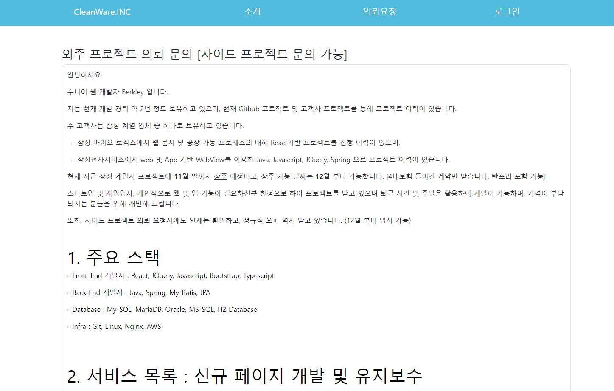

# Profile
- 프로필 관련 이력 내용 및 프리랜서용으로 구성
- Spring boot + ReactJS 기반 프로젝트로 구성
- JPA와 MySQL 혹은 MariaDB를 사용하여 데이터베이스 사용

# 프로젝트 소개
- 물류 센터 아르바이트를 하면서 방황 생활 중 더 이상 미래가 없다고 판단하여 물류센터 아르바이트를 그만 두고 그 동안 인생을 보내면서 배운 기술은 프로그래밍 관련 기술 중 하나입니다. 코딩 실력을 재활 겸 ReactJS와 Spring Boot로 다시 새로 시작하는 마음으로 시작을 하였고, 1인 프로젝트로 시작하여 재활을 하면서 이에 프로필 관련 게시물을 만들었습니다. 

# 개발 기간
- 22.05.01 ~ 22.10.15 (현재 진행형으로 개발, 유지보수 중)

# 개발 환경
- OpenJDK 17
- Gradle 7.5.4
- IDE : VS code
- FrameWork : Spring Boot (2.xx)
- Database : MySQL
- ORM : JPA

# 주요 기능
- 메인, 소개, 이력 및 기술, 프로젝트, 문의사항


# 사용 방법 (VS Code 환경 기준)
Git 사이트에서 먼저 Git을 설치 후 작업 가능 합니다.

# 작업 과제
- 프로젝트 : 사진 업로드 기능 추가, 업로드 기능 추가 이후 
- 공지&의뢰 : Draft.js 숙련 후 파일 업로드 기능 추가, 티스토리 블로그와 같이 사용하기 편리하게 작업 예정
- 설정 (톱니바퀴 모형) : 관리자 페이지 UI 구현 아이디어 기획
- 프린트 : 로그인 후 프로필 관련 내역 출력하는 기능 구현
- JWT : 로그인 시 JWT의 대한 내용을 추가한다.

### 1. 먼저 다음과 같이 Clone 합니다.
```
$ git clone https://github.com/BerkleyLim/profile.git
```


### 2. 백엔드 DB 삽입 방법
- 프론트 서버 및 백엔드 서버를 실행 하기 전에 Database 셋팅부터 먼저 작업 진행합니다.
- 자세한 사항은 profile-sql문 들어가서 README.md 파일의 대한 안내사항을 확인하고 진행합니다.

### 3. profile-front를 열어 아래와 같이 설치 후 실행

설치 방법
```
$ npm install
```

실행 방법
```
$ npm run start
```

### 4. profile-back 디렉토리를 이동하여 Gradle 입력하여 Gradle 갱신 후 실행
단, 본인의 환경이 Eclipse 기반일 경우 Gradle.build 파일을 열어 첫번째 줄에 아래와 같이 추가 후 Gradle 실행


-- Build.gradle 파일
```
apply plugin: 'eclipse-wtp'

plugins {
	id 'org.springframework.boot' version '2.7.3'
  id 'io.spring.dependency-management' version '1.0.13.RELEASE'
  id 'java'
	id 'com.moowork.node' version '1.3.1'
}
```

이후 Gradle 명령어 실행
```
$ gradle
```

새로 고침 이후, 다시 gradle bootrun으로 스프링 부트 실행한다.
```
$ gradle bootrun
```

### 5. 로그인 방법
- berkleylim16@gmail.com 으로 문의 시 알려드립니다.