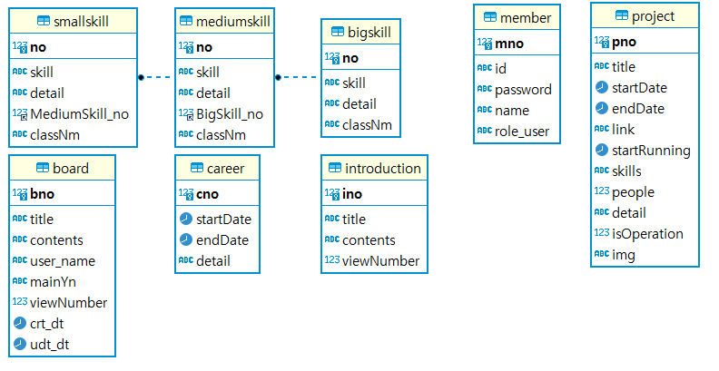

# SQL 폴더
다음은 SQL 샘플 데이터 복붙하여 사용합니다.

# 데이터 모델링 구조



# ddl 폴더
- 먼저 아래와 같이 DDL 명령어로 데이터 베이스를 추가합니다.
```
CREATE DATABASES profile;
```

초기 테이블 생성에 필요한 sql문입니다. ddl 폴더로 들어가서 sql문 복사하여 붙여넣기 합니다.


# dml 폴더
- DB 샘플로 구성된 sql 파일
- 샘플 데이터를 사용하고 싶으시면 dml 폴더의 sql파일 안에 sql문을 복사하여 붙여넣기 합니다.
